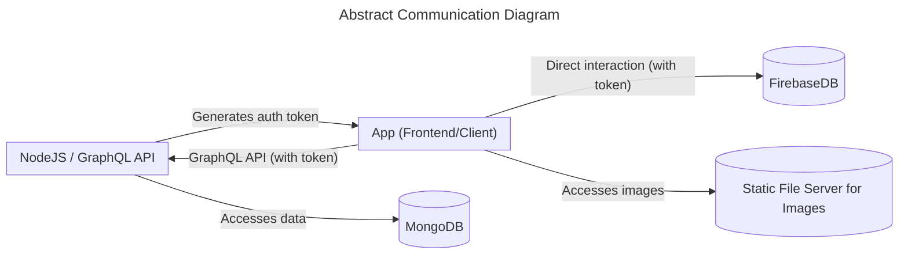

<p align="center">

</p>

# greentrition - Intolerance nutrition barcode scan app. 


greentrition is a Flutter app that empowers users with food intolerances to make informed choices. Scan barcodes, discover ingredients, and find products that fit your dietary needs. (The project was originally developed in 2021 as a personal project and is of German language.)

## Features

* **Barcode Scanning:** Quickly scan product barcodes to access detailed information.
* **Ingredient Analysis:**  Identifies potential allergens and intolerance triggers.
* **Personalized Filtering:**  Filter products and recipes based on your individual needs.
* **User-Friendly Interface:**  Intuitive design for a seamless experience.


## Architecture

greentrition uses a powerful combination of technologies:

* **Flutter:**  Cross-platform framework for a consistent experience on Android and iOS.
* **Firebase:**  Data communication and data storage for fast access.
* **GraphQL:**  Efficiently communicates with the backend API.
* **Node.js & GraphQL Endpoint:**  Handles user authentication and backend infrastructure.
* **MongoDB:**  Securely stores user data and additional product information, that does not need real-time access.

### Basic Communication Flow

The app communicates with the backend through a GraphQL endpoint. The backend is responsible for user authentication and data storage. The following flow diagram illustrates the basic communication flow:



### User Authentication 

User authentication is a crucial aspect of the app. The following sequence diagram illustrates the user authentication process:

```mermaid
sequenceDiagram
  participant Client
  participant Cloudflare
  participant API
  participant Firebase
  participant MongoDB

  Client->>+Cloudflare: Encoded credentials
  Cloudflare->>+API: Encoded credentials
  API->>API: Hash password with salt
  API->>MongoDB: Lookup user in UsersDB
  alt User found
    API->>API: Authenticate user
    API->>API: Generate Firebase token
    API->>API: Generate GraphQL API token
    API->>-Cloudflare: Firebase & GraphQL tokens
    Cloudflare->>-Client: Firebase & GraphQL tokens
    Client->>+Firebase: Access FirebaseDB (with token)
    Client->>+Cloudflare: Access GraphQL API (with token)
    Cloudflare->>+API: GraphQL request (with token)
    API->>+MongoDB: Access MongoDB (if authorized)
  else User not found
    API->>-Cloudflare: Authentication failed
    Cloudflare->>-Client: Authentication failed
  end
  ```

### Barcode Scanning and Product Lifecycle

The barcode scanning process is a core feature of the app. Each scanned product goes through a lifecycle that includes data mining, user input, and admin verification. Furthermore, the fully automated nutrition analysis is a  can be enhanced by user input. The following state diagram illustrates the product lifecycle from scanning a barcode to enhancing product information:

```mermaid
stateDiagram-v2
    [*] --> Scanning : User scans barcode
    Scanning --> Available : Product Found
    Scanning --> DataM : Product Not Found

    DataM --> Available : Product Found
    DataM --> Awaiting : Product Not Found, User Asked for Input

    Awaiting --> Available : User Provides Data
    Awaiting --> NotF2 : User Declines Input

    Available --> Enhanced : User Adds Info/Comments
    Enhanced --> Verified : Admin Verification
    Verified --> Available : Changes Made

    DataM : Data Mining
    Awaiting: Awaiting User Input
    NotF2: Not Found
    Available: Product information is displayed

 ```

### Frontend (Flutter)
   A crucial aspect of the Flutter app's structure is the navigation between screens. While representing a small part of the codebase, the screen management system is fundamental as it controls the flow and user experience throughout the entire application. This is illustrated in the following UML diagram:

   ```mermaid
classDiagram
  class ScreenManagerState {
    -PageController* _pageController
    +Home* home
    +Camera* camera
    +Profile* profile
    +String* userName
    +void initState()
    +void dispose()
    +void switchItem()
    +void changePage()
    +Widget* build()
  }


  class Home {
    +void initState()
    +void dispose()
    +void search()
    +Widget* build()
    +void loadAds()
    +void displayInterstitial()
  }

  class Camera {
    +void initState()
    +void initializeCamera()
    +void dispose()
    +void detectCode()
    +void onBarcodeDetectorClosedError()
    +void startImageStream()
    +Widget* build()
    +void showErrorProductNotFound()
  }

  class Profile {
    +Widget* build()
    +void listSavedProducts()
    +void listCommentedProducts()
  }

  ScreenManagerState o-- Home
  ScreenManagerState o-- Camera
  ScreenManagerState o-- Profile
  State <|-- ScreenManagerState
  StatefulWidget <|-- Home
  State <|-- Home
  StatefulWidget <|-- Camera
  Camera o-- BarcodeScanner
  Camera o-- CameraController
  State <|-- Camera
  StatefulWidget <|-- Profile
  ```
## Data Mining

Obtaining reliable and comprehensive product data for intolerance tracking is a significant challenge. To overcome this, we utilized data mining techniques to build a robust product database.

* **Methods:** We employed a combination of web scraping, API interaction, and data parsing to extract relevant product data from various online sources.
* **Scale:** Our data mining efforts resulted in a comprehensive database of > 200.000 products and their ingredients.

This rich dataset allows greentrition to provide accurate and detailed ingredient analysis, empowering users to make informed decisions about their food choices.


## Privacy

Your data is handled with care. User data is anonymized and securely stored within MongoDB. Product information is gathered through ethical data mining practices. 

*This repository contains the Flutter app source code. The backend and data mining code are kept private for security reasons.* 

## Screenshots 

<p float="left">
  
  
  
  

</p>

# Requirements
- Flutter version 3.0.0
- Android 10 (API-Level 29)
- Android Studio 2021.3.1.1 with Flutter Plugin

## Build IOS

```
flutter clean
```
```
flutter build ios
```


## Build Android
```
flutter build apk
```


## Server Components

UserDB using Node.js 

http://greentrition.de:2096/ 

Cors-anywhere 

http://greentrition.de:8080/

Static File Server
http://greentrition.de:8880/

Cloudflare dns

https://letswp.io/cloudflare-as-dynamic-dns-raspberry-pi/


## Trouble Shooting

- Error: MainActivity is defined multiple times
```
Remove the kotlin folder that contains a duplicate MainActivity.kt file  (https://stackoverflow.com/questions/66164771/type-project-com-project-mainactivity-is-defined-multiple-times)
```

- Errors using the google_ml_kit package
```
possible solutions:
    - flutter clean
    - upgrade the package and adjust the code
```
