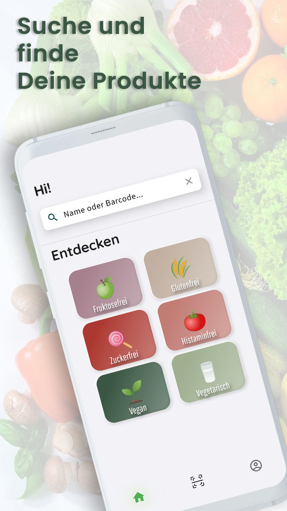
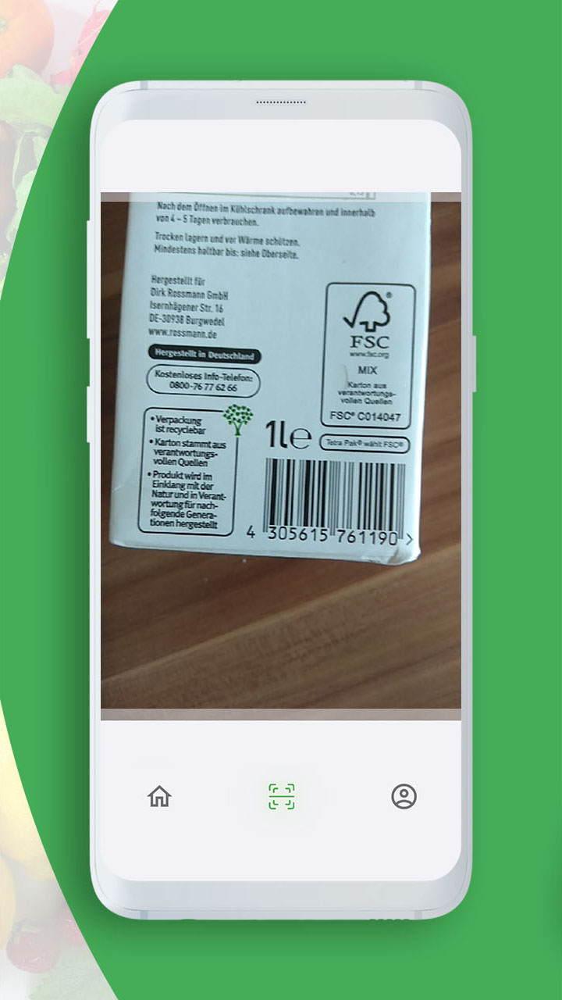
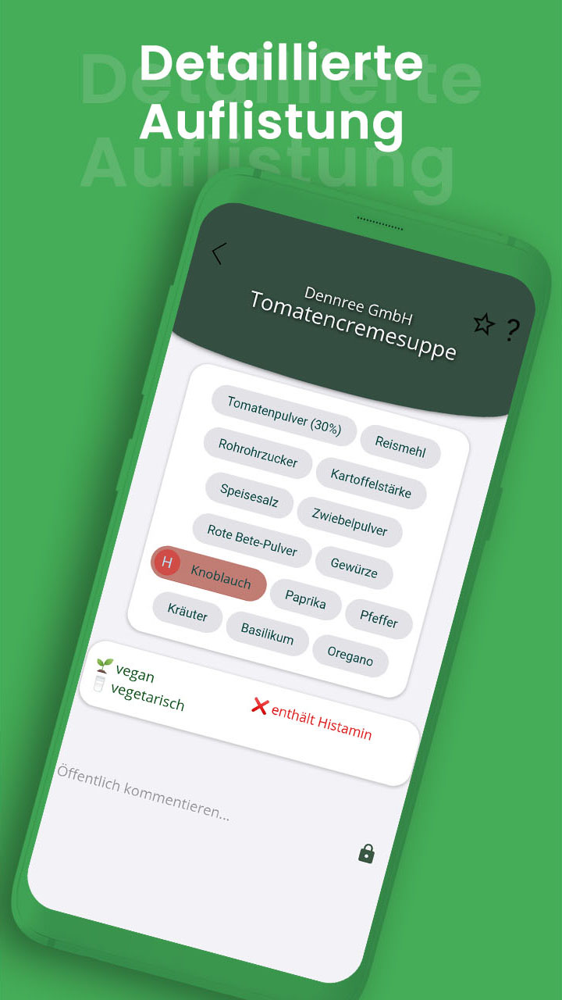
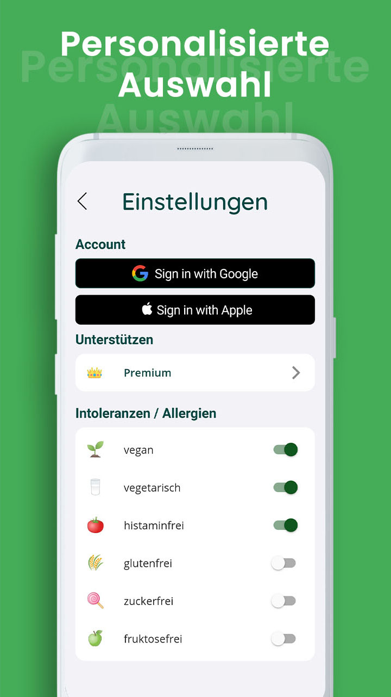

<p align="center">

</p>

# greentrition - Intolerance nutrition barcode scan app. 


greentrition is a Flutter app that empowers users with food intolerances to make informed choices. Scan barcodes, discover ingredients, and find products that fit your dietary needs. (The project was originally developed in 2021 as a personal project and is of German language.)

## Features

* **Barcode Scanning:** Quickly scan product barcodes to access detailed information.
* **Ingredient Analysis:**  Identifies potential allergens and intolerance triggers.
* **Personalized Filtering:**  Filter products and recipes based on your individual needs.
* **User-Friendly Interface:**  Intuitive design for a seamless experience.

## How it Works

greentrition uses a powerful combination of technologies:

* **Flutter:**  Cross-platform framework for a consistent experience on Android and iOS.
* **Firebase:**  Data communication and data storage for fast access.
* **GraphQL:**  Efficiently communicates with the backend API.
* **Node.js & GraphQL Endpoint:**  Handles user authentication and backend infrastructure.

## Data Mining

Obtaining reliable and comprehensive product data for intolerance tracking is a significant challenge. To overcome this, we utilized data mining techniques to build a robust product database.

* **Methods:** We employed a combination of web scraping, API interaction, and data parsing to extract relevant product data from various online sources.
* **Scale:** Our data mining efforts resulted in a comprehensive database of > 200.000 products and their ingredients.

This rich dataset allows greentrition to provide accurate and detailed ingredient analysis, empowering users to make informed decisions about their food choices.


## Privacy

Your data is handled with care. User data is anonymized and securely stored within MongoDB. Product information is gathered through ethical data mining practices. 

*This repository contains the Flutter app source code. The backend and data mining code are kept private for security reasons.* 

## Screenshots 

<p float="left">
  
  
  
  

</p>

# Requirements
- Flutter version 3.0.0
- Android 10 (API-Level 29)
- Android Studio 2021.3.1.1 with Flutter Plugin

## Build IOS

```
flutter clean
```
```
flutter build ios
```


## Build Android
```
flutter build apk
```


## Server Components

UserDB using Node.js 

http://greentrition.de:2096/ 

Cors-anywhere 

http://greentrition.de:8080/

Static File Server
http://greentrition.de:8880/

Cloudflare dns

https://letswp.io/cloudflare-as-dynamic-dns-raspberry-pi/


## Trouble Shooting

- Error: MainActivity is defined multiple times
```
Remove the kotlin folder that contains a duplicate MainActivity.kt file  (https://stackoverflow.com/questions/66164771/type-project-com-project-mainactivity-is-defined-multiple-times)
```

- Errors using the google_ml_kit package
```
possible solutions:
    - flutter clean
    - upgrade the package and adjust the code
```
